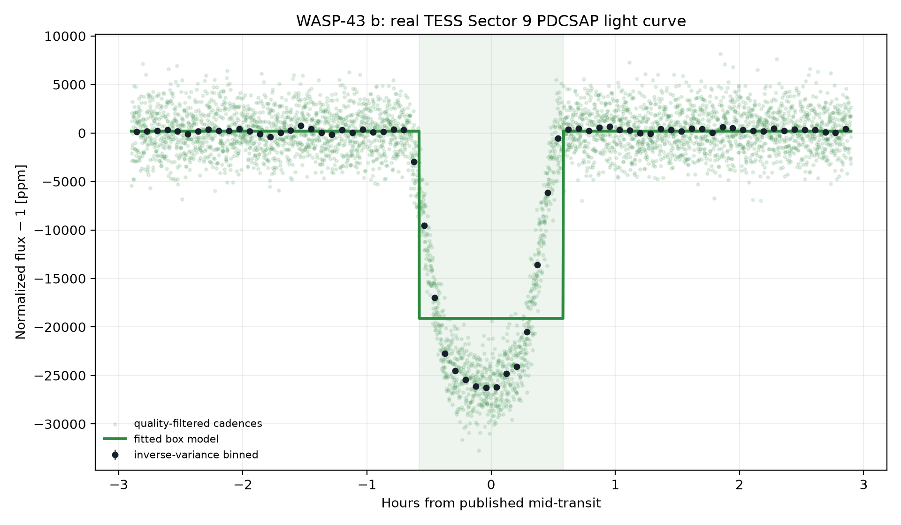
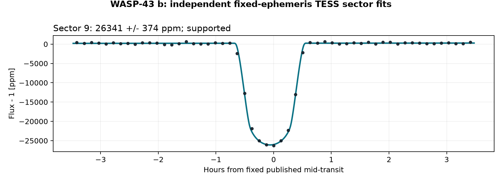
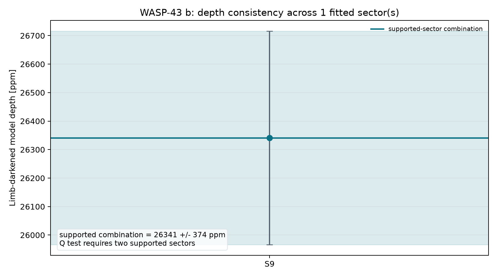
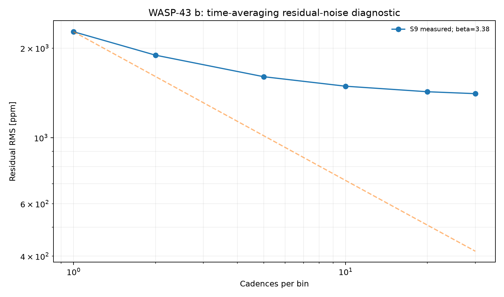
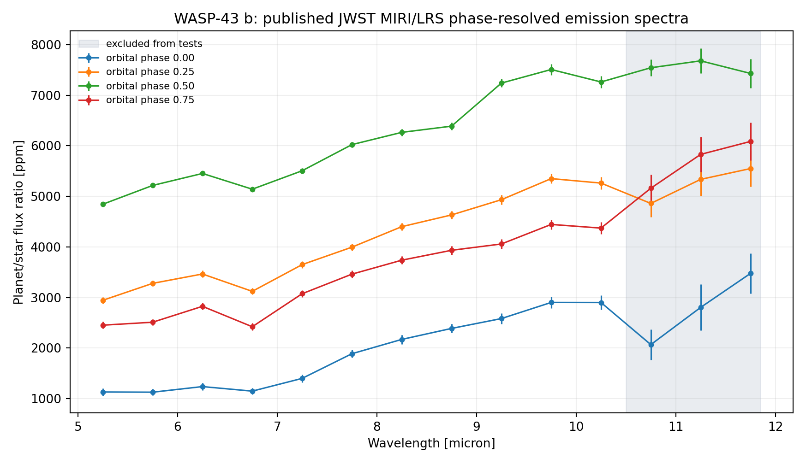
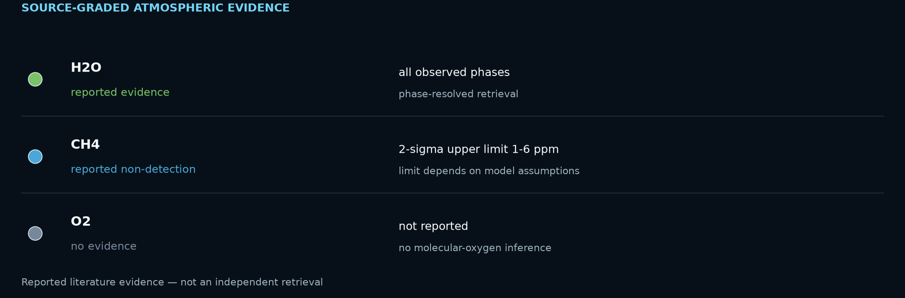

# WASP-43 b: Mapping a Hot Jupiter from Day to Night

<!-- TARGET-IDENTITY-START -->
<p align="center">
  
</p>

<p align="center"><em>AI-generated artist's interpretation informed by the measured system properties; not a direct image.</em></p>

**Hot Jupiter · thermal phase curve · JWST + TESS**

A tidally locked giant used as a weather laboratory: the report joins a corrected TESS transit to a phase-resolved JWST/MIRI spectrum and its day–night thermal contrast.
<!-- TARGET-IDENTITY-END -->
<p align="center">
  
</p>


**[Open the full report](https://biswajit1999.github.io/wasp-43b-exoplanet-report/)** — the live GitHub Pages version.

## Data sources

- **System parameters** — the saved `pscomppars` row from the [NASA Exoplanet Archive TAP service](https://exoplanetarchive.ipac.caltech.edu/TAP/sync?query=select+pl_name%2Chostname%2Cra%2Cdec%2Cpl_orbper%2Cpl_tranmid%2Cpl_trandur%2Cpl_rade%2Cpl_bmasse%2Cpl_eqt%2Cpl_orbsmax%2Csy_dist%2Csy_tmag%2Cst_teff%2Cst_rad%2Cst_mass%2Cdisc_year%2Cdiscoverymethod%2Cdisc_refname%2Cdisc_pubdate%2Cdisc_facility+from+pscomppars+where+pl_name%3D%27WASP-43+b%27&format=csv).
- **Observed photometry** — unmodified MAST file `tess2019058134432-s0009-0000000036734222-0139-s_lc.fits`, TESS Sector 9, DOI [10.17909/t9-nmc8-f686](https://doi.org/10.17909/t9-nmc8-f686). This is a real SPOC reduced light curve, not simulated data.
- Exact URLs, IDs, retrieval date, and SHA-256 checksum are in [`data/SOURCE.md`](data/SOURCE.md).

## Reproduce the analysis

```bash
pip install -r requirements.txt
python scripts/analyze_transit.py
python scripts/analyze_multisector.py
python scripts/analyze_spectrum.py
python scripts/analyze_atmospheric_evidence.py
pytest tests/ -v
```

The script keeps finite `QUALITY == 0` cadences, normalizes `PDCSAP_FLUX`, and applies one symmetric robust outlier rule. A local linear null is compared with a circular quadratic-limb-darkened transit. The archive period and predicted phase are retained, while midpoint, radius ratio, impact parameter, baseline, and baseline slope are fitted inside a bounded window. The limb-darkening coefficients and scaled semi-major axis are fixed and disclosed in the CSV.

## What the corrected fit shows

| Quantity | Result |
|---|---:|
| TESS sector | 9 |
| Cadences in fitted window | 5396 |
| Transit support | ΔBIC ≥ 10 |
| Midpoint correction | -0.061 h ± 0.08 min |
| Model mid-transit depth | 26341.2 ± 110.6 ppm |
| Radius ratio Rp/Rs | 0.15620 |
| Fitted / published duration | 1.203 / 1.159 h |
| Linear null χ² / dof / BIC | 112715.77 / 5394 / 112732.96 |
| Transit χ² / dof / BIC | 8364.12 / 5391 / 8407.09 |
| ΔBIC (null − transit) | 104325.87 |

The timing-adjusted transit is strongly preferred by ΔBIC = 104325.9. Its fitted midpoint is -0.061 hours from the historical prediction; the model's mid-transit depth is 26341.2 ± 110.6 ppm. A fitted timing correction can diagnose ephemeris drift, but this single-sector fit is not a replacement for a global transit-timing analysis.

<!-- MULTISECTOR-UPGRADE-START -->
## Multi-sector robustness and correlated noise

The archive prediction was timing-adjusted independently in 1 fitted sector(s) (S9), of which 1 meet Delta BIC >= 10. Formal depth errors were inflated by sqrt(max(reduced chi-square, 1)) times the residual time-averaging beta factor (observed range 3.38-3.38). The robust inverse-variance model depth across supported sectors is 26341.2 +/- 374.4 ppm; a sector-to-sector Q test requires at least two supported sectors. These scaled errors address underestimated scatter and short-timescale correlation, but they are not a full Gaussian-process or physical limb-darkened transit fit.

<p align="center"></p>

<p align="center"></p>

<p align="center"></p>

The per-sector table is in [`figures/multisector_statistics.csv`](figures/multisector_statistics.csv). Regenerate all three figures with `python scripts/analyze_multisector.py`.
<!-- MULTISECTOR-UPGRADE-END -->

<!-- SPECTRUM-UPGRADE-START -->
## Published planetary spectrum

<p align="center"></p>

The archive supplies 14 wavelength bins at each of four orbital phases. Weighted-flat and linear-slope fits are tabulated for every phase, exposing the changing emission level and wavelength dependence without turning this compact check into a circulation or chemical retrieval.

Source: [10.5281/zenodo.10525170](https://zenodo.org/records/10525170) (JWST MIRI/LRS). Exact files and checksums are in [`data/SOURCE.md`](data/SOURCE.md); complete numerical results are in [`figures/spectrum_statistics.csv`](figures/spectrum_statistics.csv).
<!-- SPECTRUM-UPGRADE-END -->

<!-- ATMOSPHERE-EVIDENCE-START -->
## Atmospheric evidence: detection, limit, or unknown?

<p align="center"></p>

The archived MIRI spectra reproduce strong wavelength structure at four orbital phases. Published retrievals attribute features to water and place an upper limit on methane; the repository's linear-slope tests are not molecule detections.

| Species | Status | Evidence | Basis |
|---|---|---|---|
| H2O | reported evidence | all observed phases | phase-resolved retrieval |
| CH4 | reported non-detection | 2-sigma upper limit 1-6 ppm | limit depends on model assumptions |
| O2 | no evidence | not reported | no molecular-oxygen inference |

Primary source: [Bell et al. 2024, Nature Astronomy](https://doi.org/10.1038/s41550-024-02230-x). The table is also available as [`data/atmospheric_evidence.csv`](data/atmospheric_evidence.csv). Oxygen-bearing species such as H2O, CO2, and SO2 are **not** evidence for molecular oxygen (O2) or a biosignature.
<!-- ATMOSPHERE-EVIDENCE-END -->

## System context

- Radius: 10.42 Earth radii
- Mass: 565.71 Earth masses
- Orbital period: 0.813475 days
- Transit duration: 1.159 hours
- Semi-major axis: 0.0142 AU
- Equilibrium temperature: 1427 K
- Host: WASP-43 · distance 86.75 pc
- Discovery: 2011 by Transit (SuperWASP)

## Limitations

- The orbit is assumed circular and the quadratic limb-darkening coefficients are fixed representative values; they are not atmosphere-grid interpolations.
- The scaled semi-major axis is derived from the saved composite semi-major axis and stellar radius; their uncertainties are not propagated.
- Midpoint freedom corrects accumulated ephemeris error but introduces a bounded timing search. ΔBIC, not a naïve one-parameter p-value, is used as the support gate.
- PDCSAP processing, dilution, stellar variability, transit-timing variations, and long-timescale covariance can still bias the inferred geometry.
- Radius ratio, impact parameter, and fixed limb darkening are correlated. Published global fits with physical priors and simultaneous detrending remain authoritative.

## Repository structure

```text
README.md
index.html
requirements.txt
data/                       unmodified TESS FITS + NASA row + SOURCE.md
scripts/analyze_transit.py  timing-adjusted limb-darkened transit fit
figures/                    generated plot + summary_statistics.csv
tests/                      real-data regression tests
.github/workflows/tests.yml CI on every push and pull request
LICENSE                     MIT
```

## References

1. [Hellier et al. 2011](https://ui.adsabs.harvard.edu/abs/2011arXiv1104.2823H/abstract) — discovery reference as listed by the NASA Exoplanet Archive.
2. Ricker, G. R. et al. (2015), *Transiting Exoplanet Survey Satellite (TESS)*, JATIS 1, 014003, [doi:10.1117/1.JATIS.1.1.014003](https://doi.org/10.1117/1.JATIS.1.1.014003).
3. TESS Team, *TESS Light Curves — All Sectors*, MAST, [doi:10.17909/t9-nmc8-f686](https://doi.org/10.17909/t9-nmc8-f686); Sector 9 used here.
4. [NASA Exoplanet Archive](https://exoplanetarchive.ipac.caltech.edu/), `pscomppars` TAP row retrieved 2026-08-15.

## Author

Biswajit Jana — [Portfolio](https://biswajit1999.github.io/Biswajit_Jana.github.io/) · [GitHub](https://github.com/Biswajit1999) · [LinkedIn](https://www.linkedin.com/in/biswajit-jana-27011a151/) · [ORCID](https://orcid.org/0009-0002-2411-1891)
